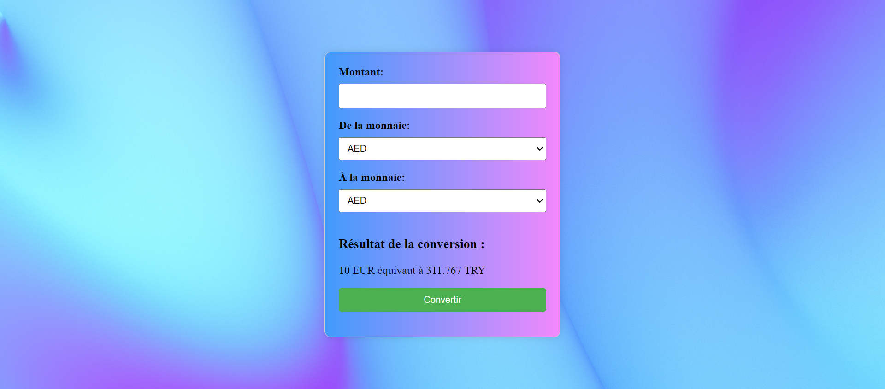

# The Dream

## Description

A project that allows real-time visualization of exchange rates for all currencies. Data is updated daily through an API.

## Live Site

[Visit the site]([link-to-your-site](http://burak-becode.free.nf/))

## Technologies Used

- PHP
- HTML
- CSS
- API: [ExchangeRatesAPI](https://exchangeratesapi.io/)

## Local Development

1. Clone the project: `git clone https://github.com/your-username/your-project.git](https://github.com/BurakTC/the-dream.git`
2. Install dependencies (if necessary): `npm install`
3. Configure environment variables (if necessary).
4. Copy the project folder to Laragon's `www` directory.
5. Open Laragon and start the Apache server.

## Copyright

© [Burcak Burakcan] - [16/11/2023]
